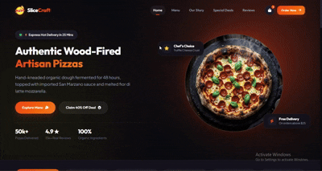

<div align="center">

# 🍕 SliceCraft — Modern Pizza & Food Delivery Web UI


> **An appetizing, vibrant, and interactive restaurant web UI tailored for gourmet pizzerias, fast-food diners, and online food ordering.**

<br>

<!-- LIVE WEBSITE DEMO ANIMATION -->
<kbd>
  
</kbd>

<br><br>

</div>

---

## ✨ Key Highlights & Features

- 🍕 **Dynamic Gourmet Menu:** Interactive categories including Pizzas, Combos, Chicken, Dips, and Beverages.
- 🛠️ **Interactive Pizza Customizer Modal:** Choose custom crusts (*Crisp Thin, Cheese Burst, Garlic Herb*), select sizes (*10", 12", 14"*), and add extra toppings with real-time price calculation.
- 🔥 **Wood-Fired Oven Showcase:** High-resolution appetizing presentation of best sellers and chef specials.
- 🛒 **Real-Time Cart Integration:** Seamless addition of customized food items with counter indicators.
- ⭐ **Customer Reviews & Social Proof:** Interactive testimonials and customer rating sections.
- 📱 **Fully Responsive Layout:** Optimized for desktop, tablet, and mobile screens.

---

## 🛠️ Tech Stack & Architecture

- **Markup:** HTML5 Semantic Architecture
- **Styling:** Custom Modular CSS3 (Responsive Breakpoints, Flexbox & CSS Grid)
- **Interactivity:** Custom JavaScript for customization modals, item selection, and cart flow
- **Theme:** Dark gourmet UI palette with vibrant accent highlights

---

## 🚀 How to View Locally

1. **Clone the repository:**
   ```bash
   git clone https://github.com/Abdullah211343/pizza-delivery-website.git
   ```

2. **Navigate to the project directory:**
   ```bash
   cd pizza-delivery-website
   ```

3. **Open `index.html`** directly in your preferred web browser:
   ```bash
   start index.html   # On Windows
   ```

---

## 🔒 Copyright & Rights Notice

This project and its design layout are crafted for **portfolio showcase and presentation purposes**.  
All design assets, compositions, and brand presentation are the work of **[Abdullah](https://github.com/Abdullah211343)**.

---

<div align="center">
  <sub>Crafted with passion by <b><a href="https://github.com/Abdullah211343">Abdullah211343</a></b></sub>
</div>
