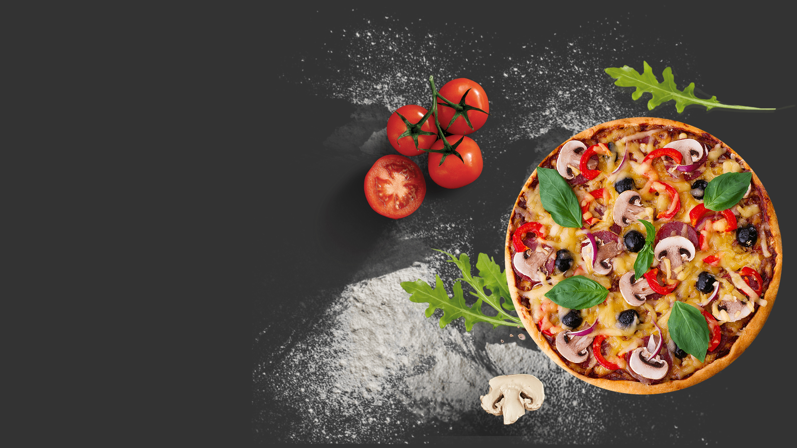

# Crust & Craft — Pizza Delivery & Restaurant Website

     

> **An appetizing, vibrant, and interactive restaurant web UI tailored for pizzerias, fast-food diners, and online food delivery businesses.**

---

## ✨ Key Highlights & Features

- ✅ **Appetizing Hero Section with Dynamic Food Presentation**
- ✅ **Category-based Food & Pizza Menu Grid**
- ✅ **Special Deals & Combo Offers Section**
- ✅ **Customer Reviews & Rating Cards**
- ✅ **Responsive CSS structure for mobile food ordering experience**

---

## 🛠️ Tech Stack & Architecture

- **Markup:** HTML5 Semantic Structure
- **Styling:** Custom Modular CSS3 (Responsive Breakpoints, Flexbox & CSS Grid)
- **Icons & Fonts:** FontAwesome / Google Fonts Typography
- **Design Paradigm:** Mobile-First, Fast Loading, Pixel-Perfect Layout

---

## 🚀 How to View Locally

1. Clone or download this repository:
   ``bash
   git clone https://github.com/Abdullah211343/pizza-delivery-website.git
   ``
2. Navigate to the project directory:
   ``bash
   cd pizza-delivery-website
   ``
3. Open index.html directly in any web browser (Chrome, Edge, Firefox, Safari).

---

## 🔒 Copyright & Rights Notice

This project template and its design layout are created for **portfolio showcase and presentation purposes**.  
All design assets, layout compositions, and brand marks are the intellectual property of **[Abdullah](https://github.com/Abdullah211343)**.

---
*Crafted with passion by **[Abdullah211343](https://github.com/Abdullah211343)***
